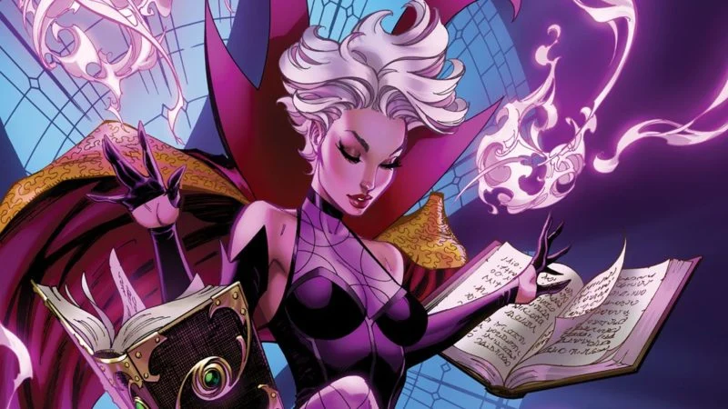

# Dr. Stange



> Temporal manipulations can create branches in time. Unstable dimensional openings.
> Spatial paradoxes! Time loops! You wanna get stuck reliving the same moment over and
> over forever or never having existed at all?

Dr. Strange is a project that seeks to enhance the processes surrounding your day.

## Features

* Time-blocking
* Pomodoro

### Development

``` sh
yarn tauri dev
```

### Production Build

``` sh
yarn tauri build
```

## Project Layout

```
├─ doc/             documentation for reamde
│  └─ assets/       images for readme
├─ src-tauri/       application source code for backend
└─ src/             web application source code
   ├─ assets/       assets used by the application
   ├─ components/   solid js components
   └─ types/        type declarations to help tslint
```

## License

```
        DO WHAT THE FUCK YOU WANT TO PUBLIC LICENSE 
                    Version 2, December 2004 

 Copyright (C) 2022 Olivier Gamache.

 Everyone is permitted to copy and distribute verbatim or modified 
 copies of this license document, and changing it is allowed as long 
 as the name is changed. 

            DO WHAT THE FUCK YOU WANT TO PUBLIC LICENSE 
   TERMS AND CONDITIONS FOR COPYING, DISTRIBUTION AND MODIFICATION 

  0. You just DO WHAT THE FUCK YOU WANT TO.
```
